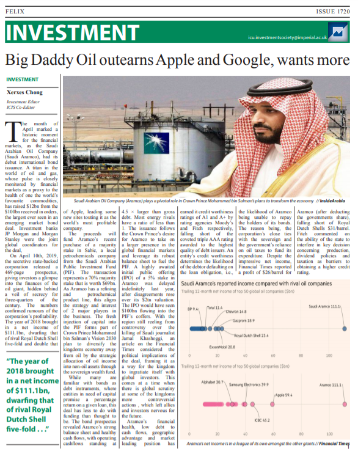

# Imperial College Portfolio
* Repository containing all notable project works and other extra-curricular during the 4-year MEng Aeronautical Engineering Course
* Roles in extra-curriculars:
  * Imperial College Investment Society
    * Co-Editor    
    * Editor-in-Chief
  * Imperial College Formula Student - Racing Green 
    * 3rd Year Group Design Project - Aerodynamics Team      
    * Student Aerodynamicist                                 
* Screenshots have been attached in this README.md to provide overview of respository content 
* For proper viewing please **download** the desired files

# Coursework
* Laboratory and project work reports
# Imperial College Investment Society
* Student newspaper articles and society magazine
  

      
  

  

      
        
      
      
  

  

      
      
  

# Imperial College Formula Student - Racing Green
* 3rd Group Design Project Report and CFD simulation analysis for Shell-Eco Marathon Vehicle
  
