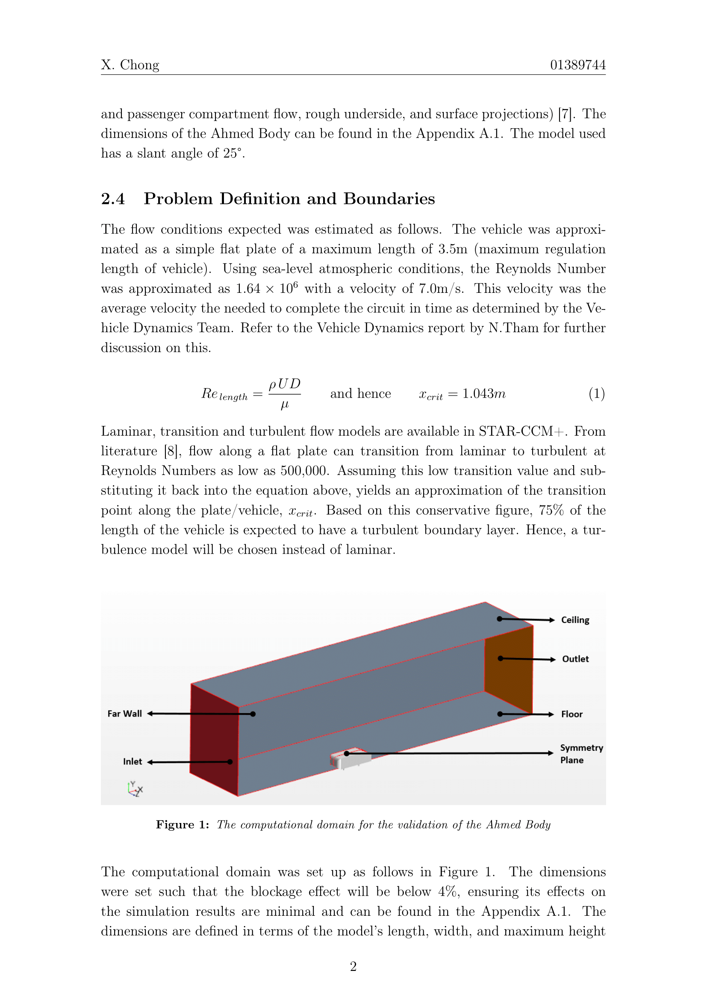

# Imperial College Portfolio
* Repository of project works, laboratory reports and extra-curriculars from the MEng Aeronautical Engineering Course
* Roles in extra-curriculars:
  * Imperial College Investment Society
    * Co-Editor    
    * Editor-in-Chief
  * Imperial College Formula Student - Racing Green 
    * 3rd Year Group Design Project - Aerodynamics Team      
    * Student Aerodynamicist                                 
* Screenshots have been attached in this README.md to provide an <ins>**overview**</ins> of respository content 
* For proper viewing please <ins>**download**</ins> the desired files

# Coursework
* Laboratory Reports
  

      
        
      
        
      
        
      
        
      
        
      
        
  

* Applied Computational Aerodynamics Report
  

      
        
      
        
  

# Imperial College Investment Society
* Newspaper articles written for the Imperial College Felix newspaper
  

      
  

  

      
        
      
      
  

* Summer Magazine 2019
  

      
      
  

# Imperial College Formula Student - Racing Green
* 3rd Year Group Design Project - Aerodynamics Team
  

      
        
      
      
  

* Student Aerodynamicist  
    

      
        
      
        
      
        
  

